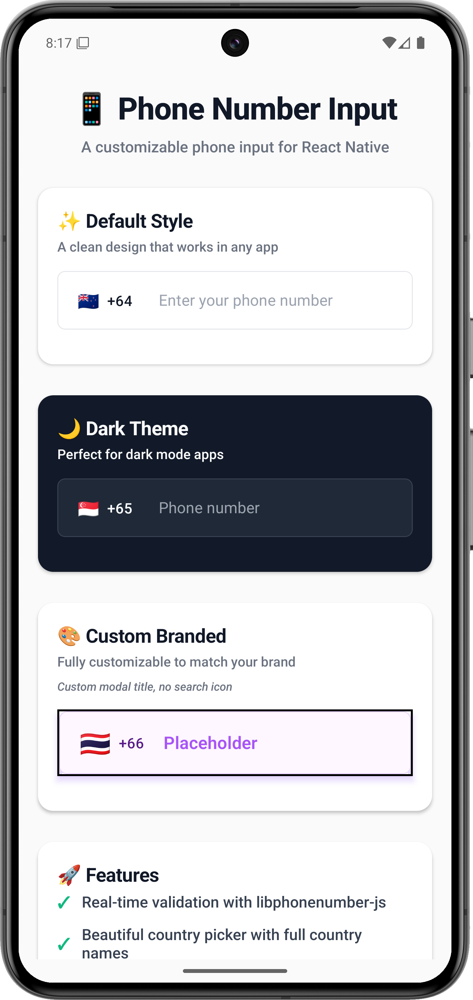
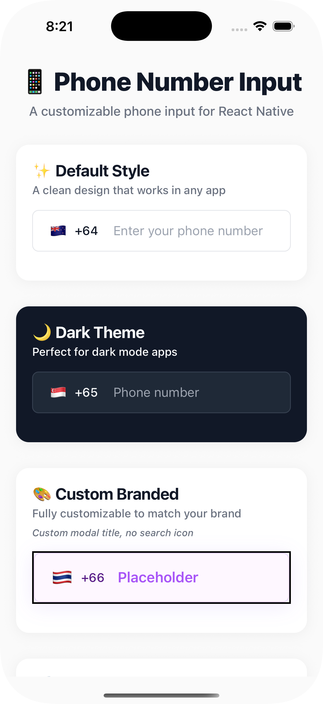
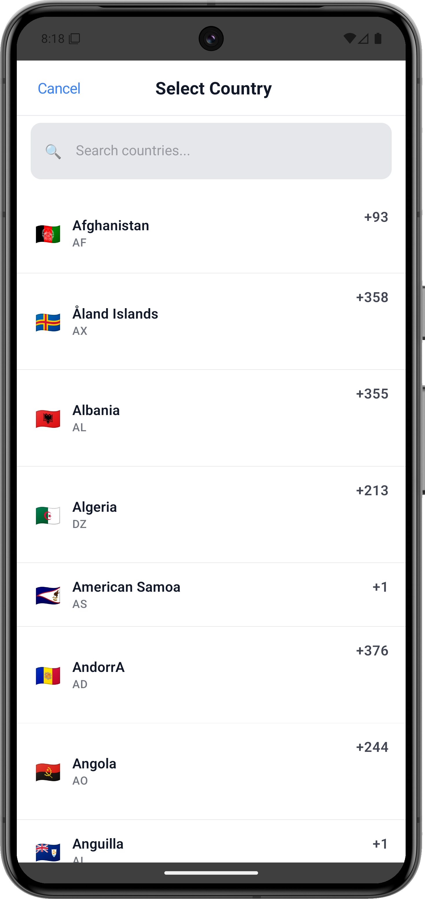
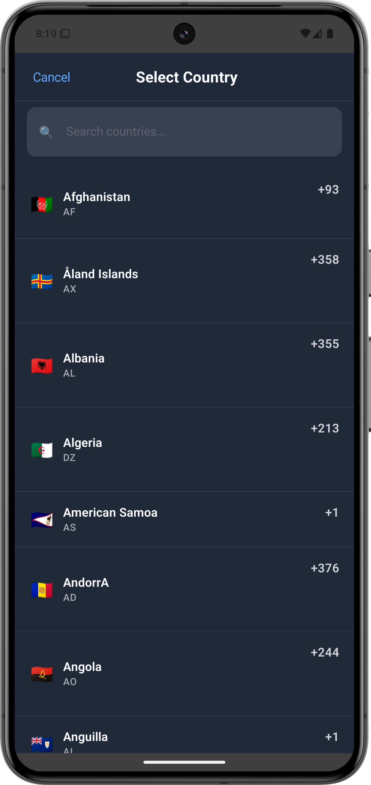
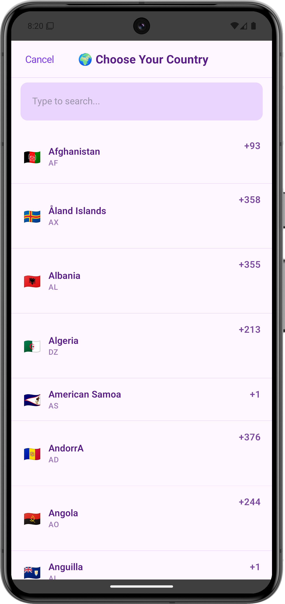
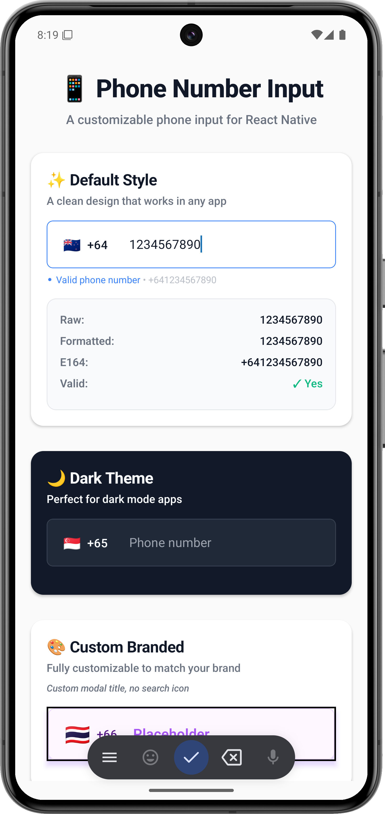
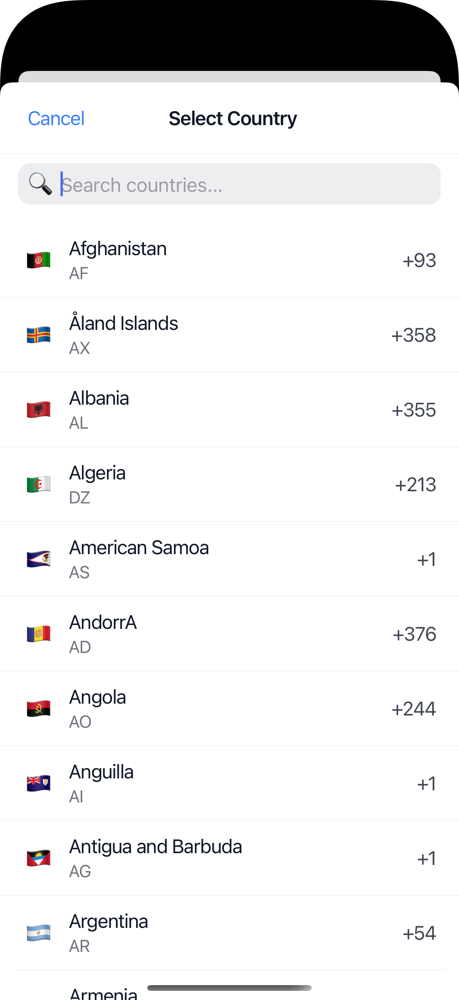
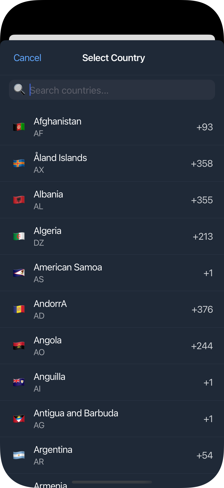
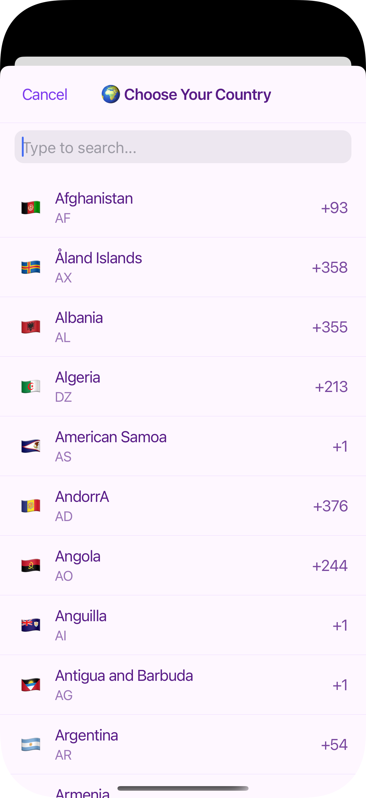
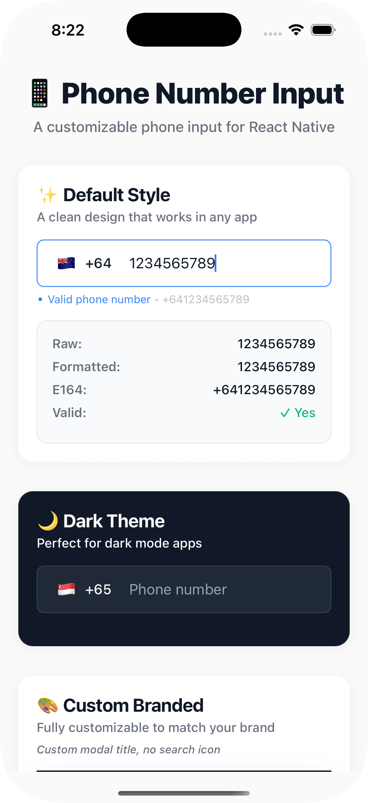

# Expo Phone Number Input

A phone number input with country code picker for React Native & Expo with full international validation powered by `libphonenumber-js`.

<p align="center" style="margin-bottom:16px;">
  
  
</p>
<p align="center" style="font-size: 12px;">
<i>
Light theme, dark theme, and custom branded examples on Android
</i>
</p>

## Features

🌍 **International Support** - 200+ countries with full English names and emoji flags  
📱 **Real-time Validation** - Powered by `libphonenumber-js` for accurate phone number parsing  
🎨 **Highly Customizable** - Extensive theming and styling options  
♿ **Accessibility Ready** - Built with accessibility best practices  
🌙 **Dark/Light Mode** - Full theme support out of the box  
📦 **Zero Dependencies** - Pure React Native implementation  
🔍 **Smart Search** - Search countries by name, code, or dialing code  
📱 **Native Keyboard** - Uses phone-pad keyboard for optimal input experience  
✅ **Live Validation** - Real-time validation with visual feedback  

## Installation

### For Expo Projects (Recommended)
```bash
npx expo install expo-phone-number-input
```

### For React Native Projects
```bash
npm install expo-phone-number-input
# or
yarn add expo-phone-number-input
```

## Quick Start

```tsx
import React, { useState } from 'react';
import { View, Text } from 'react-native';
import { PhoneNumberInput, PhoneNumberInputValue } from 'expo-phone-number-input';

export default function App() {
  const [phoneNumber, setPhoneNumber] = useState<PhoneNumberInputValue | null>(null);

  return (
    <View style={{ flex: 1, padding: 20 }}>
      <PhoneNumberInput
        value={phoneNumber}
        onChange={setPhoneNumber}
        placeholder="Enter phone number"
      />
      
      {phoneNumber && (
        <Text>
          E.164: {phoneNumber.e164 || 'Invalid'}
          Valid: {phoneNumber.isValid ? 'Yes' : 'No'}
        </Text>
      )}
    </View>
  );
}
```

## Screenshots

### Android Examples

<p align="center" style="margin-bottom:16px;">
  
  
  
  
    
</p>

### iOS Examples

<p align="center" style="margin-bottom:16px;">
  
    
  
  
    
</p>

## Visual Design

The component showcases three distinct visual themes:

### 🎨 **Default Light Theme**
- Clean, minimalistic design with subtle borders
- Professional appearance suitable for any app
- Real-time validation with status indicators
- Shows formatted phone numbers and E.164 output

### 🌙 **Dark Theme**
- Perfect for dark mode applications
- Maintains readability with proper contrast
- Consistent styling across all elements
- Ideal for apps with dark UI preferences

### 🎨 **Custom Branded**
- Fully customizable colors and styling
- Purple theme example demonstrates brand integration
- Custom modal titles and search options
- Flexible theming to match your app's design system

### 🔍 **Country Picker Modal**
- Searchable list with 200+ countries
- Full country names with ISO codes
- Emoji flags for visual recognition
- Professional modal design following platform guidelines

## Props

| Prop | Type | Default | Description |
|------|------|---------|-------------|
| `value` | `PhoneNumberInputValue \| null` | `null` | Current phone number value |
| `onChange` | `(value: PhoneNumberInputValue) => void` | - | Callback when phone number changes |
| `placeholder` | `string` | `"Enter phone number"` | Input placeholder text |
| `defaultCountry` | `CountryCode` | `"US"` | Default selected country |
| `disabled` | `boolean` | `false` | Disable the input |
| `error` | `boolean` | `false` | Show error state |
| `showStatus` | `boolean` | `true` | Show validation status |
| `modalTitle` | `string` | `"Country / Region"` | Custom modal title |
| `searchPlaceholder` | `string` | `"Search"` | Custom search placeholder |
| `showSearchIcon` | `boolean` | `true` | Show/hide search icon |
| `searchIcon` | `string` | `"🔍"` | Custom search icon |
| `style` | `ViewStyle` | - | Container style |
| `inputStyle` | `TextStyle` | - | Input field style |
| `modalStyle` | `ViewStyle` | - | Modal container style |
| `countryButtonStyle` | `ViewStyle` | - | Country button style |
| `flagStyle` | `TextStyle` | - | Flag emoji style |
| `dialCodeStyle` | `TextStyle` | - | Dial code style |

## Types

```tsx
interface PhoneNumberInputValue {
  raw: string;           // Raw digits only
  international: string; // Formatted international number
  e164: string | null;   // E.164 format (e.g., +1234567890)
  country: CountryCode;  // Selected country code
  isValid: boolean;      // Validation status
}

type CountryCode = string; // ISO 3166-1 alpha-2 country code
```

## Advanced Usage

### Custom Styling (Purple Theme Example)

```tsx
<PhoneNumberInput
  value={phoneNumber}
  onChange={setPhoneNumber}
  placeholder="Placeholder"
  defaultCountry="TH"
  
  // Purple theme styling
  colorBackground="#FEF7FF"
  colorBorder="#E9D5FF"
  colorText="#581C87"
  colorPlaceholder="#A855F7"
  colorAccent="#7C3AED"
  colorDanger="#DC2626"
  
  // Custom modal
  modalTitle="🌍 Choose Your Country"
  searchPlaceholder="Type to search..."
  showSearchIcon={false}
  
  // Custom container styling
  containerStyle={{
    borderWidth: 2,
    shadowColor: '#7C3AED',
    shadowOffset: { width: 0, height: 4 },
    shadowOpacity: 0.1,
    shadowRadius: 12,
    elevation: 4,
  }}
  inputStyle={{
    fontSize: 18,
    fontWeight: '600',
  }}
  flagTextStyle={{
    fontSize: 26,
  }}
/>
```

### Dark Mode Support

```tsx
<PhoneNumberInput
  value={phoneNumber}
  onChange={setPhoneNumber}
  style={{
    backgroundColor: isDarkMode ? '#2a2a2a' : '#ffffff',
  }}
  inputStyle={{
    color: isDarkMode ? '#ffffff' : '#000000',
  }}
/>
```

### Error Handling

```tsx
<PhoneNumberInput
  value={phoneNumber}
  onChange={setPhoneNumber}
  error={!phoneNumber?.isValid && phoneNumber?.raw.length > 0}
  showStatus={true}
/>
```

### Validation Display

The component shows real-time validation status:

```tsx
{phoneNumber && (
  <View style={{ marginTop: 20 }}>
    <Text>Raw: {phoneNumber.raw}</Text>
    <Text>Formatted: {phoneNumber.international}</Text>
    <Text>E.164: {phoneNumber.e164 || 'Invalid'}</Text>
    <Text>Valid: {phoneNumber.isValid ? '✓ Yes' : '✗ No'}</Text>
    <Text>Country: {phoneNumber.country}</Text>
  </View>
)}
```

This displays the validation information shown in the screenshots, including the E.164 format and validation status.

## Examples

Check out the [example app](./example) for more usage examples including:
- Basic implementation
- Custom styling
- Dark/light theme switching
- Error states
- Accessibility features

## Development

```bash
# Install dependencies
npm install

# Build the package
npm run build

# Run the example app
cd example
npm install
npx expo start
```

## Contributing

1. Fork the repository
2. Create your feature branch (`git checkout -b feature/amazing-feature`)
3. Commit your changes (`git commit -m 'Add some amazing feature'`)
4. Push to the branch (`git push origin feature/amazing-feature`)
5. Open a Pull Request

## Support

This library was originally developed for my side mobile project and is maintained in my spare time. While I'll do my best to address issues and improvements, please note that this is not a full-time maintained project.

If you find this library helpful in your projects, a cup of coffee would be greatly appreciated! ☕

[](https://www.buymeacoffee.com/koko-mojo-astro)

Your support helps keep this open-source project alive and motivates future improvements! 🚀

## License

MIT © [koko-mojo-astro](https://github.com/koko-mojo-astro)
